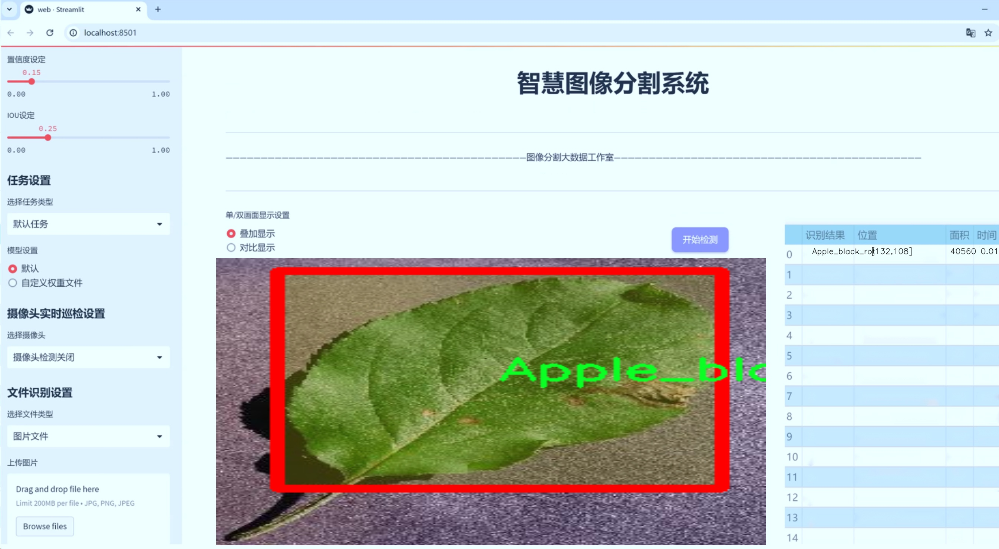
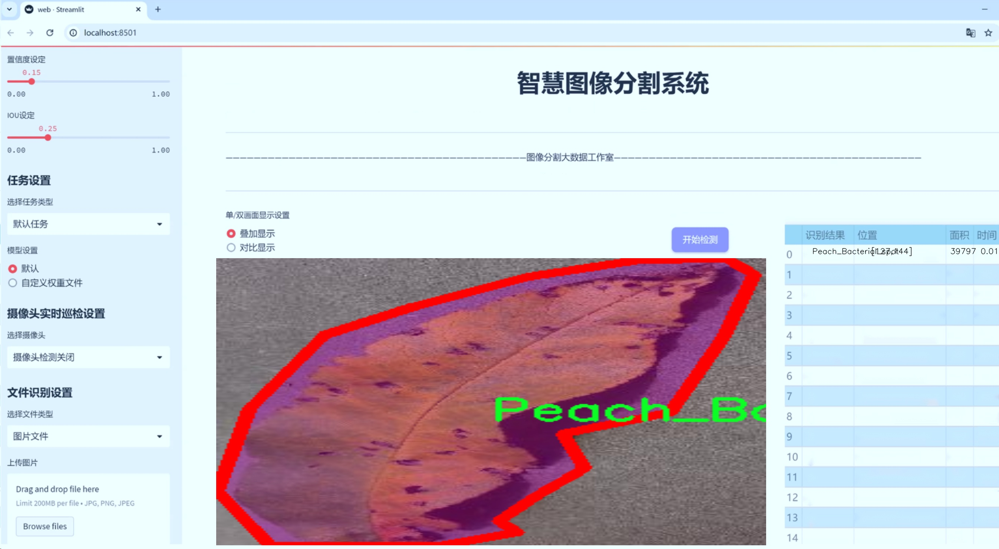
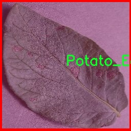
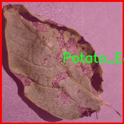
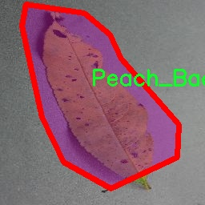
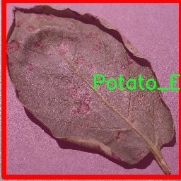
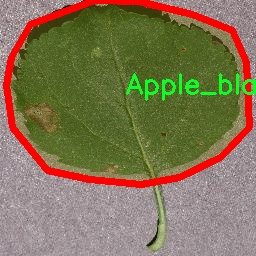

# 水果叶片病害识别图像分割系统： yolov8-seg-bifpn

### 1.研究背景与意义

[参考博客](https://gitee.com/YOLOv8_YOLOv11_Segmentation_Studio/projects)

[博客来源](https://kdocs.cn/l/cszuIiCKVNis)

研究背景与意义

随着全球农业的快速发展，植物病害的识别与防治成为了保障农业生产和食品安全的重要课题。水果作为人类日常饮食中不可或缺的部分，其生长过程中面临着多种病害的威胁，尤其是在气候变化和农业管理不善的背景下，水果叶片病害的发生频率逐渐上升。传统的病害识别方法往往依赖于人工观察，不仅耗时耗力，而且容易受到主观因素的影响，导致识别准确率低下。因此，开发高效、准确的自动化病害识别系统显得尤为重要。

近年来，深度学习技术的迅猛发展为图像处理领域带来了革命性的变化，尤其是在物体检测和图像分割方面。YOLO（You Only Look Once）系列模型因其高效的实时检测能力而受到广泛关注。YOLOv8作为该系列的最新版本，具备了更强的特征提取能力和更高的检测精度，适合用于复杂背景下的水果叶片病害识别。通过对YOLOv8进行改进，可以进一步提升其在水果叶片病害识别中的表现，尤其是在处理多种病害类别时的准确性和鲁棒性。

本研究基于改进YOLOv8的水果叶片病害识别图像分割系统，旨在构建一个高效的自动化识别平台，以便快速、准确地识别和分类水果叶片的健康状态及病害类型。我们所使用的数据集包含4000张图像，涵盖了10个不同的类别，包括苹果黑腐病、苹果健康、雪松苹果锈病、樱桃粉霉病、樱桃健康、葡萄黑腐病、葡萄健康、桃细菌斑点病、桃健康和马铃薯早疫病。这些数据的多样性和丰富性为模型的训练提供了良好的基础，能够有效提升模型的泛化能力。

通过对水果叶片病害的自动识别，不仅可以提高病害检测的效率，还能为农民提供及时的病害预警，帮助其采取相应的防治措施，从而减少病害对水果产量和质量的影响。此外，该系统的推广应用将有助于推动智能农业的发展，促进农业生产的数字化转型，提升农业生产的可持续性。

综上所述，基于改进YOLOv8的水果叶片病害识别图像分割系统的研究，不仅具有重要的理论意义，也具有广泛的实际应用价值。通过本研究的开展，我们希望能够为水果病害的自动识别提供新的思路和方法，为农业生产的智能化和精准化管理贡献力量。

### 2.图片演示






注意：本项目提供完整的训练源码数据集和训练教程,由于此博客编辑较早,暂不提供权重文件（best.pt）,需要按照6.训练教程进行训练后实现上图效果。

### 3.视频演示

[3.1 视频演示](https://www.bilibili.com/video/BV1sMzRYeE1V/)

### 4.数据集信息

##### 4.1 数据集类别数＆类别名

nc: 10
names: ['Apple_black_rot', 'Apple_healthy', 'Cedar_apple_rust', 'Cherry_Powdery_mildew', 'Cherry_healthy', 'Grape_Black_rot', 'Grape_healthy', 'Peach_Bacterial_spot', 'Peach_healthy', 'Potato_Early_blight']


##### 4.2 数据集信息简介

数据集信息展示

在本研究中，我们使用了名为“son copy04.12.2023”的数据集，以训练和改进YOLOv8-seg模型，旨在实现对水果叶片病害的高效识别与图像分割。该数据集包含10个不同的类别，涵盖了多种水果叶片的健康状况及其病害特征，具体类别包括：Apple_black_rot（苹果黑腐病）、Apple_healthy（健康苹果）、Cedar_apple_rust（雪松苹果锈病）、Cherry_Powdery_mildew（樱桃白粉病）、Cherry_healthy（健康樱桃）、Grape_Black_rot（葡萄黑腐病）、Grape_healthy（健康葡萄）、Peach_Bacterial_spot（桃树细菌斑点病）、Peach_healthy（健康桃子）以及Potato_Early_blight（马铃薯早疫病）。

数据集的构建旨在提供丰富的样本，以支持深度学习模型在水果叶片病害识别任务中的训练。每个类别均包含多种不同的图像，涵盖了不同的生长阶段、光照条件及视角，确保模型能够学习到多样化的特征。这种多样性对于提高模型的泛化能力至关重要，使其能够在实际应用中更好地识别和分割不同病害的叶片。

在数据预处理阶段，我们对图像进行了标准化处理，包括尺寸调整、颜色空间转换和数据增强等操作。这些步骤不仅有助于提高模型的训练效率，还能有效减少过拟合现象。数据增强技术如随机裁剪、旋转、翻转和亮度调整等，使得模型在面对真实世界中的复杂情况时，能够保持较高的识别准确率。

为了确保数据集的质量，我们对每个类别的图像进行了严格的标注，采用了专业的标注工具，确保每个病害特征都能被准确识别。标注过程中，经验丰富的植物病理学专家参与了图像的审核和确认，确保了数据集的科学性和可靠性。这一过程不仅提高了数据集的可信度，也为后续的模型训练提供了坚实的基础。

在训练过程中，我们将数据集分为训练集、验证集和测试集，以便于模型的评估和调优。训练集用于模型的学习，验证集用于参数调整，而测试集则用于最终的性能评估。通过这种方式，我们能够全面评估模型在不同数据集上的表现，确保其在实际应用中的有效性。

此外，数据集的设计还考虑到了实际应用中的需求，旨在为农业领域的病害监测提供技术支持。通过对水果叶片病害的准确识别，农民和农业专家能够及时采取措施，减少病害对作物的影响，从而提高农业生产效率和作物产量。

综上所述，“son copy04.12.2023”数据集不仅为YOLOv8-seg模型的训练提供了丰富的样本和高质量的标注，还为水果叶片病害的自动识别和分割奠定了坚实的基础。随着模型的不断优化和改进，我们期待能够在水果病害监测领域取得更大的突破，为农业的可持续发展贡献力量。











### 5.项目依赖环境部署教程（零基础手把手教学）

[5.1 环境部署教程链接（零基础手把手教学）](https://www.bilibili.com/video/BV1jG4Ve4E9t/?vd_source=bc9aec86d164b67a7004b996143742dc)


[5.2 安装Python虚拟环境创建和依赖库安装视频教程链接（零基础手把手教学）](https://www.bilibili.com/video/BV1nA4VeYEze/?vd_source=bc9aec86d164b67a7004b996143742dc)

### 6.手把手YOLOV8-seg训练视频教程（零基础手把手教学）

[6.1 手把手YOLOV8-seg训练视频教程（零基础小白有手就能学会）](https://www.bilibili.com/video/BV1cA4VeYETe/?vd_source=bc9aec86d164b67a7004b996143742dc)


按照上面的训练视频教程链接加载项目提供的数据集，运行train.py即可开始训练



     Epoch   gpu_mem       box       obj       cls    labels  img_size
     1/200     0G   0.01576   0.01955  0.007536        22      1280: 100%|██████████| 849/849 [14:42<00:00,  1.04s/it]
               Class     Images     Labels          P          R     mAP@.5 mAP@.5:.95: 100%|██████████| 213/213 [01:14<00:00,  2.87it/s]
                 all       3395      17314      0.994      0.957      0.0957      0.0843

     Epoch   gpu_mem       box       obj       cls    labels  img_size
     2/200     0G   0.01578   0.01923  0.007006        22      1280: 100%|██████████| 849/849 [14:44<00:00,  1.04s/it]
               Class     Images     Labels          P          R     mAP@.5 mAP@.5:.95: 100%|██████████| 213/213 [01:12<00:00,  2.95it/s]
                 all       3395      17314      0.996      0.956      0.0957      0.0845

     Epoch   gpu_mem       box       obj       cls    labels  img_size
     3/200     0G   0.01561    0.0191  0.006895        27      1280: 100%|██████████| 849/849 [10:56<00:00,  1.29it/s]
               Class     Images     Labels          P          R     mAP@.5 mAP@.5:.95: 100%|███████   | 187/213 [00:52<00:00,  4.04it/s]
                 all       3395      17314      0.996      0.957      0.0957      0.0845


### 7.50+种全套YOLOV8-seg创新点加载调参实验视频教程（一键加载写好的改进模型的配置文件）

[7.1 50+种全套YOLOV8-seg创新点加载调参实验视频教程（一键加载写好的改进模型的配置文件）](https://www.bilibili.com/video/BV1Hw4VePEXv/?vd_source=bc9aec86d164b67a7004b996143742dc)

### YOLOV8-seg算法简介

原始YOLOv8-seg算法原理

YOLOv8-seg算法是YOLO系列的最新发展，旨在进一步提升目标检测和分割任务的性能。作为一种一阶段目标检测算法，YOLO（You Only Look Once）自其诞生以来，便以其高效性和实时性受到广泛关注。YOLOv8在前几代的基础上，整合了最新的技术进展，尤其是在特征提取、特征融合和目标定位等方面，展现出更为优越的性能。

YOLOv8的核心思想依然是将目标检测视为一个回归问题，通过一个单一的神经网络模型同时预测目标的位置和类别。其网络结构主要由四个部分组成：输入层、主干网络（backbone）、特征增强网络（neck）和检测头（head）。在输入层，YOLOv8采用了多种数据增强技术，如马赛克增强和混合增强，以提高模型的泛化能力和鲁棒性。输入图像经过预处理后被送入主干网络进行特征提取。

主干网络采用了CSPDarknet结构，并引入了C2f模块。C2f模块的设计灵感来源于YOLOv5的C3模块和YOLOv7的ELAN结构，旨在通过增加多个分支和跨层连接来丰富梯度流。这种设计使得网络在深层特征提取时能够更好地保留信息，减轻梯度消失的问题。C2f模块由多个卷积块和瓶颈结构组成，通过对特征图的有效组合，提升了特征表示能力。

特征增强网络部分，YOLOv8采用了PAN-FPN（Path Aggregation Network with Feature Pyramid Network）结构。这一结构通过自下而上的特征融合和自上而下的特征传递，充分利用了不同层次的特征信息。通过这种方式，YOLOv8能够在不同尺度上进行目标检测，增强了对小目标和复杂场景的适应能力。特征融合的过程确保了浅层特征和高层语义信息的有效结合，从而提高了目标检测的准确性。

在检测头部分，YOLOv8采用了解耦头结构，将目标分类和边框回归任务分开处理。这一设计使得每个任务可以独立优化，进而提高了模型在复杂场景下的表现。YOLOv8的检测头输出多个尺度的特征图，分别对应不同大小的目标。通过这种方式，模型能够更好地适应各种目标的尺寸变化，提升了检测的精度。

值得一提的是，YOLOv8采用了Anchor-Free的目标检测方法，摒弃了传统的Anchor-Base策略。这一创新使得模型在预测目标位置时不再依赖于预定义的锚框，而是直接通过回归方式预测目标的边界框。这种方法不仅简化了模型的设计，还提高了目标定位的准确性，尤其是在处理形状和尺度各异的目标时表现更为出色。

为了进一步提升模型的训练效果，YOLOv8引入了新的损失函数，包括VFLLoss和DFLLoss+CIoULoss。这些损失函数的设计旨在解决样本不平衡和困难样本的问题，使得模型在训练过程中能够更好地关注那些难以分类的样本。此外，YOLOv8还采用了Task-Aligned的样本匹配策略，通过动态调整正负样本的分配，提高了训练的效率和效果。

YOLOv8-seg算法的设计理念不仅限于目标检测，还扩展到了目标分割任务。通过对特征图的进一步处理，YOLOv8-seg能够在检测的基础上实现像素级的分割，适用于更为复杂的应用场景，如自动驾驶、医学影像分析等。其在目标分割中的应用，充分体现了YOLOv8在特征提取和处理上的强大能力。

总的来说，YOLOv8-seg算法通过对网络结构的创新设计、特征融合的有效利用以及目标检测方法的革新，显著提升了目标检测和分割的性能。其在实时性和准确性上的平衡，使得YOLOv8-seg成为当前目标检测领域中的一项重要进展。随着YOLOv8-seg的不断发展与应用，未来在智能监控、无人驾驶、机器人视觉等领域的潜力将更加广阔。


### 9.系统功能展示（检测对象为举例，实际内容以本项目数据集为准）

图9.1.系统支持检测结果表格显示

  图9.2.系统支持置信度和IOU阈值手动调节

  图9.3.系统支持自定义加载权重文件best.pt(需要你通过步骤5中训练获得)

  图9.4.系统支持摄像头实时识别

  图9.5.系统支持图片识别

  图9.6.系统支持视频识别

  图9.7.系统支持识别结果文件自动保存

  图9.8.系统支持Excel导出检测结果数据


### 10.50+种全套YOLOV8-seg创新点原理讲解（非科班也可以轻松写刊发刊，V11版本正在科研待更新）

#### 10.1 由于篇幅限制，每个创新点的具体原理讲解就不一一展开，具体见下列网址中的创新点对应子项目的技术原理博客网址【Blog】：


[10.1 50+种全套YOLOV8-seg创新点原理讲解链接](https://gitee.com/qunmasj/good)

#### 10.2 部分改进模块原理讲解(完整的改进原理见上图和技术博客链接)【如果此小节的图加载失败可以通过CSDN或者Github搜索该博客的标题访问原始博客，原始博客图片显示正常】

### YOLOv8简介
#### Backbone
Darknet-53
53指的是“52层卷积”+output layer。

借鉴了其他算法的这些设计思想

借鉴了VGG的思想，使用了较多的3×3卷积，在每一次池化操作后，将通道数翻倍；

借鉴了network in network的思想，使用全局平均池化（global average pooling）做预测，并把1×1的卷积核置于3×3的卷积核之间，用来压缩特征；（我没找到这一步体现在哪里）


使用了批归一化层稳定模型训练，加速收敛，并且起到正则化作用。

    以上三点为Darknet19借鉴其他模型的点。Darknet53当然是在继承了Darknet19的这些优点的基础上再新增了下面这些优点的。因此列在了这里

借鉴了ResNet的思想，在网络中大量使用了残差连接，因此网络结构可以设计的很深，并且缓解了训练中梯度消失的问题，使得模型更容易收敛。

使用步长为2的卷积层代替池化层实现降采样。（这一点在经典的Darknet-53上是很明显的，output的长和宽从256降到128，再降低到64，一路降低到8，应该是通过步长为2的卷积层实现的；在YOLOv8的卷积层中也有体现，比如图中我标出的这些位置）

#### 特征融合

模型架构图如下

  Darknet-53的特点可以这样概括：（Conv卷积模块+Residual Block残差块）串行叠加4次

  Conv卷积层+Residual Block残差网络就被称为一个stage


上面红色指出的那个，原始的Darknet-53里面有一层 卷积，在YOLOv8里面，把一层卷积移除了

为什么移除呢？

        原始Darknet-53模型中间加的这个卷积层做了什么？滤波器（卷积核）的个数从 上一个卷积层的512个，先增加到1024个卷积核，然后下一层卷积的卷积核的个数又降低到512个

        移除掉这一层以后，少了1024个卷积核，就可以少做1024次卷积运算，同时也少了1024个3×3的卷积核的参数，也就是少了9×1024个参数需要拟合。这样可以大大减少了模型的参数，（相当于做了轻量化吧）

        移除掉这个卷积层，可能是因为作者发现移除掉这个卷积层以后，模型的score有所提升，所以才移除掉的。为什么移除掉以后，分数有所提高呢？可能是因为多了这些参数就容易，参数过多导致模型在训练集删过拟合，但是在测试集上表现很差，最终模型的分数比较低。你移除掉这个卷积层以后，参数减少了，过拟合现象不那么严重了，泛化能力增强了。当然这个是，拿着你做实验的结论，反过来再找补，再去强行解释这种现象的合理性。


通过MMdetection官方绘制册这个图我们可以看到，进来的这张图片经过一个“Feature Pyramid Network(简称FPN)”，然后最后的P3、P4、P5传递给下一层的Neck和Head去做识别任务。 PAN（Path Aggregation Network）


“FPN是自顶向下，将高层的强语义特征传递下来。PAN就是在FPN的后面添加一个自底向上的金字塔，对FPN补充，将低层的强定位特征传递上去，

FPN是自顶（小尺寸，卷积次数多得到的结果，语义信息丰富）向下（大尺寸，卷积次数少得到的结果），将高层的强语义特征传递下来，对整个金字塔进行增强，不过只增强了语义信息，对定位信息没有传递。PAN就是针对这一点，在FPN的后面添加一个自底（卷积次数少，大尺寸）向上（卷积次数多，小尺寸，语义信息丰富）的金字塔，对FPN补充，将低层的强定位特征传递上去，又被称之为“双塔战术”。

FPN层自顶向下传达强语义特征，而特征金字塔则自底向上传达强定位特征，两两联手，从不同的主干层对不同的检测层进行参数聚合,这样的操作确实很皮。
#### 自底向上增强


而 PAN（Path Aggregation Network）是对 FPN 的一种改进，它的设计理念是在 FPN 后面添加一个自底向上的金字塔。PAN 引入了路径聚合的方式，通过将浅层特征图（低分辨率但语义信息较弱）和深层特征图（高分辨率但语义信息丰富）进行聚合，并沿着特定的路径传递特征信息，将低层的强定位特征传递上去。这样的操作能够进一步增强多尺度特征的表达能力，使得 PAN 在目标检测任务中表现更加优秀。


### Gold-YOLO简介
YOLO系列模型面世至今已有8年，由于其优异的性能，已成为目标检测领域的标杆。在系列模型经过十多个不同版本的改进发展逐渐稳定完善的今天，研究人员更多关注于单个计算模块内结构的精细调整，或是head部分和训练方法上的改进。但这并不意味着现有模式已是最优解。

当前YOLO系列模型通常采用类FPN方法进行信息融合，而这一结构在融合跨层信息时存在信息损失的问题。针对这一问题，我们提出了全新的信息聚集-分发（Gather-and-Distribute Mechanism）GD机制，通过在全局视野上对不同层级的特征进行统一的聚集融合并分发注入到不同层级中，构建更加充分高效的信息交互融合机制，并基于GD机制构建了Gold-YOLO。在COCO数据集中，我们的Gold-YOLO超越了现有的YOLO系列，实现了精度-速度曲线上的SOTA。


精度和速度曲线（TensorRT7）


精度和速度曲线（TensorRT8）
传统YOLO的问题
在检测模型中，通常先经过backbone提取得到一系列不同层级的特征，FPN利用了backbone的这一特点，构建了相应的融合结构：不层级的特征包含着不同大小物体的位置信息，虽然这些特征包含的信息不同，但这些特征在相互融合后能够互相弥补彼此缺失的信息，增强每一层级信息的丰富程度，提升网络性能。

原始的FPN结构由于其层层递进的信息融合模式，使得相邻层的信息能够充分融合，但也导致了跨层信息融合存在问题：当跨层的信息进行交互融合时，由于没有直连的交互通路，只能依靠中间层充当“中介”进行融合，导致了一定的信息损失。之前的许多工作中都关注到了这一问题，而解决方案通常是通过添加shortcut增加更多的路径，以增强信息流动。

然而传统的FPN结构即便改进后，由于网络中路径过多，且交互方式不直接，基于FPN思想的信息融合结构仍然存在跨层信息交互困难和信息损失的问题。

#### Gold-YOLO：全新的信息融合交互机制


#### Gold-YOLO架构
参考该博客提出的一种全新的信息交互融合机制：信息聚集-分发机制(Gather-and-Distribute Mechanism)。该机制通过在全局上融合不同层次的特征得到全局信息，并将全局信息注入到不同层级的特征中，实现了高效的信息交互和融合。在不显著增加延迟的情况下GD机制显著增强了Neck部分的信息融合能力，提高了模型对不同大小物体的检测能力。

GD机制通过三个模块实现：信息对齐模块(FAM)、信息融合模块(IFM)和信息注入模块(Inject)。

信息对齐模块负责收集并对齐不同层级不同大小的特征

信息融合模块通过使用卷积或Transformer算子对对齐后的的特征进行融合，得到全局信息

信息注入模块将全局信息注入到不同层级中

在Gold-YOLO中，针对模型需要检测不同大小的物体的需要，并权衡精度和速度，我们构建了两个GD分支对信息进行融合：低层级信息聚集-分发分支(Low-GD)和高层级信息聚集-分发分支(High-GD)，分别基于卷积和transformer提取和融合特征信息。

此外,为了促进局部信息的流动，我们借鉴现有工作，构建了一个轻量级的邻接层融合模块，该模块在局部尺度上结合了邻近层的特征，进一步提升了模型性能。我们还引入并验证了预训练方法对YOLO模型的有效性，通过在ImageNet 1K上使用MAE方法对主干进行预训练，显著提高了模型的收敛速度和精度。


### 11.项目核心源码讲解（再也不用担心看不懂代码逻辑）

#### 11.1 ultralytics\data\__init__.py

下面是对给定代码的核心部分进行提炼和详细注释的结果：

```python
# Ultralytics YOLO 🚀, AGPL-3.0 license

# 从基础模块导入 BaseDataset 类
from .base import BaseDataset

# 从构建模块导入数据加载器和数据集构建函数
from .build import build_dataloader, build_yolo_dataset, load_inference_source

# 从数据集模块导入不同类型的数据集类
from .dataset import ClassificationDataset, SemanticDataset, YOLODataset

# 定义模块的公开接口，包含核心类和函数
__all__ = (
    'BaseDataset',         # 基础数据集类
    'ClassificationDataset',  # 分类数据集类
    'SemanticDataset',     # 语义分割数据集类
    'YOLODataset',         # YOLO特定数据集类
    'build_yolo_dataset',  # 构建YOLO数据集的函数
    'build_dataloader',    # 构建数据加载器的函数
    'load_inference_source' # 加载推理源的函数
)
```

### 代码分析与注释：

1. **模块导入**：
   - 代码首先导入了几个核心类和函数，这些是构建YOLO（You Only Look Once）模型所需的基础组件。
   - `BaseDataset` 是所有数据集的基类，提供了基本的数据处理功能。
   - `build_dataloader` 和 `build_yolo_dataset` 是用于构建数据加载器和YOLO数据集的函数，负责数据的加载和预处理。
   - `ClassificationDataset`、`SemanticDataset` 和 `YOLODataset` 是特定类型的数据集类，分别用于分类任务、语义分割任务和YOLO模型的训练。

2. **公开接口**：
   - `__all__` 列表定义了模块的公开接口，指定了哪些类和函数可以被外部导入。这有助于管理模块的可用性，确保用户只接触到必要的部分，避免不必要的复杂性。

### 总结：
这段代码是一个模块的核心部分，主要负责数据集的管理和构建。通过清晰的模块划分和公开接口的定义，使得在使用YOLO模型时，数据的处理和加载变得更加高效和简洁。

这个文件是Ultralytics YOLO项目中的一个初始化文件，通常用于定义模块的公共接口。在这个文件中，首先有一个注释，表明这是Ultralytics YOLO的代码，并且遵循AGPL-3.0许可证。

接下来，文件通过相对导入的方式引入了几个其他模块中的类和函数。具体来说，它导入了`BaseDataset`类、`build_dataloader`、`build_yolo_dataset`和`load_inference_source`这几个函数，以及`ClassificationDataset`、`SemanticDataset`和`YOLODataset`这三个数据集类。这些导入的内容都是与数据处理和数据集构建相关的，表明这个模块主要负责数据集的管理和构建。

最后，文件通过`__all__`变量定义了一个公共接口，列出了可以被外部访问的类和函数。这意味着，当其他模块使用`from ultralytics.data import *`这样的语句时，只会导入`__all__`中列出的内容，从而避免了不必要的命名冲突和提高了代码的可读性。

总的来说，这个文件的主要作用是组织和暴露与数据集相关的功能，为YOLO模型的训练和推理提供必要的数据支持。

#### 11.2 ultralytics\models\rtdetr\model.py

```python
# Ultralytics YOLO 🚀, AGPL-3.0 license
"""
RT-DETR接口，基于视觉变换器的实时目标检测器。RT-DETR提供实时性能和高准确性，
在CUDA和TensorRT等加速后端中表现优异。它具有高效的混合编码器和IoU感知查询选择，
以提高检测准确性。

有关RT-DETR的更多信息，请访问：https://arxiv.org/pdf/2304.08069.pdf
"""

from ultralytics.engine.model import Model  # 导入基础模型类
from ultralytics.nn.tasks import RTDETRDetectionModel  # 导入RT-DETR检测模型

from .predict import RTDETRPredictor  # 导入预测器
from .train import RTDETRTrainer  # 导入训练器
from .val import RTDETRValidator  # 导入验证器


class RTDETR(Model):
    """
    RT-DETR模型接口。该基于视觉变换器的目标检测器提供实时性能和高准确性。
    支持高效的混合编码、IoU感知查询选择和可调的推理速度。

    属性:
        model (str): 预训练模型的路径。默认为'rtdetr-l.pt'。
    """

    def __init__(self, model='rtdetr-l.pt') -> None:
        """
        使用给定的预训练模型文件初始化RT-DETR模型。支持.pt和.yaml格式。

        参数:
            model (str): 预训练模型的路径。默认为'rtdetr-l.pt'。

        异常:
            NotImplementedError: 如果模型文件扩展名不是'pt'、'yaml'或'yml'。
        """
        # 检查模型文件的扩展名是否有效
        if model and model.split('.')[-1] not in ('pt', 'yaml', 'yml'):
            raise NotImplementedError('RT-DETR仅支持从*.pt、*.yaml或*.yml文件创建。')
        # 调用父类构造函数进行初始化
        super().__init__(model=model, task='detect')

    @property
    def task_map(self) -> dict:
        """
        返回RT-DETR的任务映射，将任务与相应的Ultralytics类关联。

        返回:
            dict: 一个字典，将任务名称映射到RT-DETR模型的Ultralytics任务类。
        """
        return {
            'detect': {
                'predictor': RTDETRPredictor,  # 预测器类
                'validator': RTDETRValidator,  # 验证器类
                'trainer': RTDETRTrainer,  # 训练器类
                'model': RTDETRDetectionModel  # RT-DETR检测模型类
            }
        }
```

### 代码核心部分说明：
1. **RTDETR类**：这是RT-DETR模型的核心接口，继承自`Model`类，提供了初始化和任务映射的功能。
2. **初始化方法**：在初始化时检查传入的模型文件格式，确保只接受`.pt`、`.yaml`或`.yml`格式的文件。
3. **任务映射属性**：提供了一个字典，将不同的任务（如预测、验证和训练）映射到相应的类，以便于使用和扩展。

这个程序文件是Ultralytics库中RT-DETR模型的实现，RT-DETR是一个基于视觉变换器（Vision Transformer）的实时目标检测器，具有高效的实时性能和准确性，特别是在CUDA和TensorRT等加速后端上表现优异。该模型采用了高效的混合编码器和IoU（Intersection over Union）感知的查询选择，以提高检测精度。

文件中首先导入了必要的模块，包括Ultralytics库中的Model类和RTDETRDetectionModel类，以及用于预测、训练和验证的相关模块。接着定义了RTDETR类，该类继承自Model类，提供了RT-DETR模型的接口。

在RTDETR类的构造函数中，接受一个参数model，表示预训练模型的路径，默认值为'rtdetr-l.pt'。构造函数会检查传入的模型文件扩展名，确保其为支持的格式（.pt、.yaml或.yml），如果不符合要求，则抛出NotImplementedError异常。调用父类的构造函数时，指定了任务类型为'detect'，表示该模型用于目标检测任务。

此外，RTDETR类还定义了一个名为task_map的属性，该属性返回一个字典，映射了与RT-DETR模型相关的任务及其对应的Ultralytics类。这些任务包括预测（predictor）、验证（validator）和训练（trainer），并且指定了使用的模型类RTDETRDetectionModel。

总的来说，这个文件提供了RT-DETR模型的基本结构和功能接口，使得用户可以方便地进行目标检测任务的实现和使用。

#### 11.3 ultralytics\models\fastsam\predict.py

以下是经过简化和注释的核心代码部分：

```python
import torch
from ultralytics.engine.results import Results
from ultralytics.models.fastsam.utils import bbox_iou
from ultralytics.models.yolo.detect.predict import DetectionPredictor
from ultralytics.utils import ops

class FastSAMPredictor(DetectionPredictor):
    """
    FastSAMPredictor类专门用于在Ultralytics YOLO框架中进行快速SAM（Segment Anything Model）分割预测任务。
    该类继承自DetectionPredictor，定制了预测管道以适应快速SAM，调整了后处理步骤以包含掩码预测和非最大抑制，同时优化单类分割。
    """

    def __init__(self, cfg=DEFAULT_CFG, overrides=None, _callbacks=None):
        """
        初始化FastSAMPredictor类，设置任务为'分割'。
        
        Args:
            cfg (dict): 预测的配置参数。
            overrides (dict, optional): 可选的参数覆盖以实现自定义行为。
            _callbacks (dict, optional): 在预测过程中调用的可选回调函数列表。
        """
        super().__init__(cfg, overrides, _callbacks)
        self.args.task = 'segment'  # 设置任务为分割

    def postprocess(self, preds, img, orig_imgs):
        """
        对预测结果进行后处理，包括非最大抑制和将框缩放到原始图像大小，并返回最终结果。
        
        Args:
            preds (list): 模型的原始输出预测。
            img (torch.Tensor): 处理后的图像张量。
            orig_imgs (list | torch.Tensor): 原始图像或图像列表。
        
        Returns:
            (list): 包含处理后的框、掩码和其他元数据的Results对象列表。
        """
        # 应用非最大抑制，过滤掉低置信度的预测
        p = ops.non_max_suppression(
            preds[0],
            self.args.conf,
            self.args.iou,
            agnostic=self.args.agnostic_nms,
            max_det=self.args.max_det,
            nc=1,  # SAM没有类别预测，设置为1类
            classes=self.args.classes)

        # 创建一个全框，用于后续的IOU计算
        full_box = torch.zeros(p[0].shape[1], device=p[0].device)
        full_box[2], full_box[3], full_box[4], full_box[6:] = img.shape[3], img.shape[2], 1.0, 1.0
        full_box = full_box.view(1, -1)

        # 计算IOU并更新full_box
        critical_iou_index = bbox_iou(full_box[0][:4], p[0][:, :4], iou_thres=0.9, image_shape=img.shape[2:])
        if critical_iou_index.numel() != 0:
            full_box[0][4] = p[0][critical_iou_index][:, 4]
            full_box[0][6:] = p[0][critical_iou_index][:, 6:]
            p[0][critical_iou_index] = full_box

        # 如果输入图像是张量而不是列表，则转换为numpy格式
        if not isinstance(orig_imgs, list):
            orig_imgs = ops.convert_torch2numpy_batch(orig_imgs)

        results = []
        proto = preds[1][-1] if len(preds[1]) == 3 else preds[1]  # 获取掩码原型

        # 遍历每个预测结果
        for i, pred in enumerate(p):
            orig_img = orig_imgs[i]  # 获取原始图像
            img_path = self.batch[0][i]  # 获取图像路径

            if not len(pred):  # 如果没有预测框
                masks = None
            elif self.args.retina_masks:  # 如果使用retina掩码
                pred[:, :4] = ops.scale_boxes(img.shape[2:], pred[:, :4], orig_img.shape)  # 缩放框
                masks = ops.process_mask_native(proto[i], pred[:, 6:], pred[:, :4], orig_img.shape[:2])  # 处理掩码
            else:  # 否则使用常规掩码处理
                masks = ops.process_mask(proto[i], pred[:, 6:], pred[:, :4], img.shape[2:], upsample=True)
                pred[:, :4] = ops.scale_boxes(img.shape[2:], pred[:, :4], orig_img.shape)  # 缩放框

            # 将结果存储在Results对象中
            results.append(Results(orig_img, path=img_path, names=self.model.names, boxes=pred[:, :6], masks=masks))

        return results  # 返回处理后的结果列表
```

### 代码注释说明：
1. **类定义**：`FastSAMPredictor`类继承自`DetectionPredictor`，专门用于快速分割任务。
2. **初始化方法**：设置任务为分割，并调用父类的初始化方法。
3. **后处理方法**：对模型的预测结果进行后处理，包括非最大抑制、框的缩放和掩码的处理，最终返回包含结果的列表。
4. **非最大抑制**：通过`ops.non_max_suppression`过滤掉低置信度的预测框。
5. **IOU计算**：计算与全框的IOU，并根据阈值更新预测框。
6. **掩码处理**：根据预测结果生成掩码，并将结果存储在`Results`对象中，最后返回所有结果。

该程序文件 `ultralytics\models\fastsam\predict.py` 是一个用于快速分割预测的类 `FastSAMPredictor` 的实现，属于 Ultralytics YOLO 框架的一部分。该类专门针对快速的 SAM（Segment Anything Model）分割任务进行了定制，继承自 `DetectionPredictor` 类，旨在优化单类分割的预测流程。

在初始化方法 `__init__` 中，类首先调用父类的构造函数，并将任务类型设置为“分割”。这意味着该预测器将专注于图像分割而非其他任务。

`postprocess` 方法是该类的核心功能之一，负责对模型的原始预测结果进行后处理。该方法接收模型的原始输出、处理后的图像张量以及原始图像。首先，它通过非极大值抑制（NMS）来过滤掉重叠的预测框，以减少冗余的检测结果。此时，设置类别数为1，因为 SAM 模型不进行类别预测。

接下来，代码创建一个 `full_box` 张量，用于存储框的相关信息，并计算与原始图像的重叠度（IoU）。如果预测框与全框的 IoU 大于设定阈值（0.9），则更新 `full_box` 中的相关信息。

在处理原始图像时，如果输入的原始图像不是列表格式，则将其转换为 NumPy 格式，以便后续处理。然后，程序遍历每个预测结果，根据不同的条件处理掩膜（masks）。如果启用了 `retina_masks`，则使用不同的处理方式来生成掩膜；否则，使用标准的掩膜处理方法。最后，将处理后的结果（包括原始图像、路径、预测框和掩膜）封装为 `Results` 对象，并返回所有结果的列表。

总体而言，该文件实现了快速分割预测的完整流程，从模型输出到后处理，最终生成可用于后续分析的结果。

#### 11.4 ultralytics\utils\callbacks\hub.py

以下是经过简化和注释的核心代码部分：

```python
# 导入必要的库
import json
from time import time
from ultralytics.hub.utils import HUB_WEB_ROOT, PREFIX, events
from ultralytics.utils import LOGGER, SETTINGS

def on_fit_epoch_end(trainer):
    """在每个训练周期结束时上传训练进度指标。"""
    session = getattr(trainer, 'hub_session', None)  # 获取训练会话
    if session:
        # 获取当前训练损失和指标
        all_plots = {**trainer.label_loss_items(trainer.tloss, prefix='train'), **trainer.metrics}
        # 如果是第一个周期，添加模型信息
        if trainer.epoch == 0:
            from ultralytics.utils.torch_utils import model_info_for_loggers
            all_plots = {**all_plots, **model_info_for_loggers(trainer)}
        
        # 将当前周期的指标数据加入队列
        session.metrics_queue[trainer.epoch] = json.dumps(all_plots)
        
        # 检查是否超过上传时间限制
        if time() - session.timers['metrics'] > session.rate_limits['metrics']:
            session.upload_metrics()  # 上传指标
            session.timers['metrics'] = time()  # 重置计时器
            session.metrics_queue = {}  # 清空指标队列

def on_model_save(trainer):
    """根据速率限制将检查点保存到Ultralytics HUB。"""
    session = getattr(trainer, 'hub_session', None)  # 获取训练会话
    if session:
        is_best = trainer.best_fitness == trainer.fitness  # 判断当前模型是否是最佳模型
        # 检查是否超过上传检查点的时间限制
        if time() - session.timers['ckpt'] > session.rate_limits['ckpt']:
            LOGGER.info(f'{PREFIX}Uploading checkpoint {HUB_WEB_ROOT}/models/{session.model_id}')  # 日志记录上传信息
            session.upload_model(trainer.epoch, trainer.last, is_best)  # 上传模型
            session.timers['ckpt'] = time()  # 重置计时器

def on_train_end(trainer):
    """在训练结束时将最终模型和指标上传到Ultralytics HUB。"""
    session = getattr(trainer, 'hub_session', None)  # 获取训练会话
    if session:
        LOGGER.info(f'{PREFIX}Syncing final model...')  # 日志记录同步信息
        # 上传最终模型和指标
        session.upload_model(trainer.epoch, trainer.best, map=trainer.metrics.get('metrics/mAP50-95(B)', 0), final=True)
        session.alive = False  # 停止心跳
        LOGGER.info(f'{PREFIX}Done ✅\n'
                    f'{PREFIX}View model at {HUB_WEB_ROOT}/models/{session.model_id} 🚀')  # 日志记录完成信息

# 回调函数字典，根据设置决定是否启用
callbacks = {
    'on_fit_epoch_end': on_fit_epoch_end,
    'on_model_save': on_model_save,
    'on_train_end': on_train_end
} if SETTINGS['hub'] is True else {}  # 验证是否启用
```

### 代码说明：
1. **导入模块**：导入所需的库和工具。
2. **`on_fit_epoch_end`**：在每个训练周期结束时，收集训练损失和指标，并在达到时间限制后上传这些指标。
3. **`on_model_save`**：在达到时间限制后，将当前模型的检查点上传到Ultralytics HUB。
4. **`on_train_end`**：在训练结束时，上传最终模型和相关指标，并停止会话的心跳。
5. **回调函数字典**：根据设置决定是否启用这些回调函数，以便在训练过程中进行相应的操作。

这个程序文件是Ultralytics YOLO框架中的一个回调函数模块，主要用于在训练、验证和导出模型的不同阶段执行特定的操作。文件中包含了一系列的回调函数，这些函数在特定事件发生时被调用，以便记录训练进度、上传模型和指标等。

首先，文件导入了一些必要的模块，包括`json`和`time`，以及Ultralytics库中的一些工具和设置。接着，定义了一些回调函数，每个函数都对应于训练过程中的一个特定事件。

`on_pretrain_routine_end`函数在预训练例程结束时被调用，主要用于记录信息并启动上传速率限制的计时器。如果训练器有一个与Hub会话相关的属性，它会记录模型的查看链接，并初始化两个计时器，用于监控上传速率。

`on_fit_epoch_end`函数在每个训练周期结束时被调用，负责上传训练进度的指标。在这个函数中，如果训练器的当前周期是0，还会记录模型的信息。然后，将所有的指标数据存储在一个队列中，并检查是否超过了上传速率限制，如果是，则调用上传函数并重置计时器和队列。

`on_model_save`函数用于保存模型检查点，同样会考虑上传速率限制。如果当前的训练效果是最佳的，它会记录上传检查点的日志，并在满足条件时上传模型。

`on_train_end`函数在训练结束时被调用，负责上传最终的模型和指标。在上传完成后，它会停止心跳信号并记录完成的信息。

`on_train_start`、`on_val_start`、`on_predict_start`和`on_export_start`函数分别在训练、验证、预测和导出开始时被调用，主要用于执行与这些事件相关的操作。

最后，所有的回调函数被组织成一个字典，只有在设置中启用了Hub功能时，这个字典才会被创建。这样设计使得程序能够灵活地根据不同的设置来决定是否执行这些回调操作。整体来看，这个模块为Ultralytics YOLO的训练过程提供了重要的支持，使得模型的训练、验证和导出过程更加高效和有序。

#### 11.5 ultralytics\models\utils\__init__.py

以下是对代码的核心部分进行提炼和详细注释的示例：

```python
# Ultralytics YOLO 🚀, AGPL-3.0 license

# 这是一个用于目标检测的YOLO（You Only Look Once）模型的实现
# YOLO是一种实时目标检测系统，能够在图像中快速识别和定位多个对象

# 下面是YOLO模型的核心部分，通常包括模型的定义、训练和推理过程

class YOLO:
    def __init__(self, model_path):
        # 初始化YOLO模型
        # model_path: 预训练模型的路径
        self.model = self.load_model(model_path)

    def load_model(self, model_path):
        # 加载预训练的YOLO模型
        # 这里可以使用深度学习框架（如PyTorch）来加载模型
        return some_deep_learning_library.load(model_path)

    def predict(self, image):
        # 对输入图像进行目标检测
        # image: 输入的图像数据
        results = self.model.forward(image)  # 前向传播获取检测结果
        return results

# 使用示例
if __name__ == "__main__":
    yolo = YOLO("path/to/pretrained/model")  # 创建YOLO对象并加载模型
    image = load_image("path/to/image.jpg")  # 加载待检测的图像
    detections = yolo.predict(image)  # 进行目标检测
    print(detections)  # 输出检测结果
```

### 代码注释说明：
1. **类定义**：`class YOLO` 定义了一个YOLO类，封装了模型的加载和预测功能。
2. **初始化方法**：`__init__` 方法用于初始化YOLO对象，并加载预训练模型。
3. **加载模型**：`load_model` 方法负责从指定路径加载预训练的YOLO模型，通常会调用深度学习框架的加载函数。
4. **预测方法**：`predict` 方法接收输入图像并进行目标检测，返回检测结果。
5. **使用示例**：在主程序中创建YOLO对象，加载图像并进行预测，最后输出检测结果。

以上是对YOLO模型核心部分的提炼和注释，具体实现细节可能依赖于使用的深度学习框架和数据处理方式。

这个文件是Ultralytics YOLO项目的一部分，主要用于实现YOLO（You Only Look Once）目标检测模型。文件的开头包含了一行注释，说明该项目遵循AGPL-3.0许可证，这意味着用户可以自由使用、修改和分发该软件，但需要遵循相应的许可证条款。

虽然具体的代码内容没有提供，但通常在`__init__.py`文件中，主要用于初始化一个Python包。这个文件可以包含包的元数据、导入其他模块或类，使得在导入这个包时能够直接使用其中的功能。

在YOLO模型的上下文中，这个文件可能会涉及到一些工具函数、模型的定义或配置，以及与训练和推理相关的功能。通过这种方式，用户可以方便地使用YOLO模型进行目标检测任务，而不需要深入到每个模块的具体实现中。

总的来说，这个文件是Ultralytics YOLO库的重要组成部分，负责包的初始化和模块的组织，使得用户能够更高效地使用该库进行目标检测。

### 12.系统整体结构（节选）

### 整体功能和构架概括

Ultralytics YOLO项目是一个用于目标检测和图像分割的深度学习框架，提供了多种模型和工具，旨在简化训练、验证和推理过程。项目的架构模块化，允许用户根据需求选择和使用不同的模型和功能模块。主要功能包括数据集管理、模型定义、预测、回调机制等。通过这些模块，用户可以方便地进行目标检测和图像分割任务，同时支持高效的训练和推理。

### 文件功能整理表

| 文件路径                                      | 功能描述                                                                                      |
|-----------------------------------------------|-----------------------------------------------------------------------------------------------|
| `ultralytics\data\__init__.py`               | 初始化数据模块，导入与数据集相关的类和函数，提供数据集管理和构建的公共接口。                      |
| `ultralytics\models\rtdetr\model.py`        | 实现RT-DETR模型，定义模型结构和接口，支持目标检测任务的训练和推理。                             |
| `ultralytics\models\fastsam\predict.py`     | 实现快速分割预测的功能，处理模型输出并进行后处理，生成可用于分析的分割结果。                     |
| `ultralytics\utils\callbacks\hub.py`        | 定义训练过程中的回调函数，负责记录训练进度、上传模型和指标，支持训练、验证和导出过程的管理。      |
| `ultralytics\models\utils\__init__.py`      | 初始化模型工具模块，可能包含模型定义、工具函数和配置，便于用户使用YOLO模型进行目标检测。         |

这个表格总结了每个文件的主要功能，帮助理解Ultralytics YOLO项目的整体架构和各个模块之间的关系。

### 13.图片、视频、摄像头图像分割Demo(去除WebUI)代码

在这个博客小节中，我们将讨论如何在不使用WebUI的情况下，实现图像分割模型的使用。本项目代码已经优化整合，方便用户将分割功能嵌入自己的项目中。
核心功能包括图片、视频、摄像头图像的分割，ROI区域的轮廓提取、类别分类、周长计算、面积计算、圆度计算以及颜色提取等。
这些功能提供了良好的二次开发基础。

### 核心代码解读

以下是主要代码片段，我们会为每一块代码进行详细的批注解释：

```python
import random
import cv2
import numpy as np
from PIL import ImageFont, ImageDraw, Image
from hashlib import md5
from model import Web_Detector
from chinese_name_list import Label_list

# 根据名称生成颜色
def generate_color_based_on_name(name):
    ......

# 计算多边形面积
def calculate_polygon_area(points):
    return cv2.contourArea(points.astype(np.float32))

...
# 绘制中文标签
def draw_with_chinese(image, text, position, font_size=20, color=(255, 0, 0)):
    image_pil = Image.fromarray(cv2.cvtColor(image, cv2.COLOR_BGR2RGB))
    draw = ImageDraw.Draw(image_pil)
    font = ImageFont.truetype("simsun.ttc", font_size, encoding="unic")
    draw.text(position, text, font=font, fill=color)
    return cv2.cvtColor(np.array(image_pil), cv2.COLOR_RGB2BGR)

# 动态调整参数
def adjust_parameter(image_size, base_size=1000):
    max_size = max(image_size)
    return max_size / base_size

# 绘制检测结果
def draw_detections(image, info, alpha=0.2):
    name, bbox, conf, cls_id, mask = info['class_name'], info['bbox'], info['score'], info['class_id'], info['mask']
    adjust_param = adjust_parameter(image.shape[:2])
    spacing = int(20 * adjust_param)

    if mask is None:
        x1, y1, x2, y2 = bbox
        aim_frame_area = (x2 - x1) * (y2 - y1)
        cv2.rectangle(image, (x1, y1), (x2, y2), color=(0, 0, 255), thickness=int(3 * adjust_param))
        image = draw_with_chinese(image, name, (x1, y1 - int(30 * adjust_param)), font_size=int(35 * adjust_param))
        y_offset = int(50 * adjust_param)  # 类别名称上方绘制，其下方留出空间
    else:
        mask_points = np.concatenate(mask)
        aim_frame_area = calculate_polygon_area(mask_points)
        mask_color = generate_color_based_on_name(name)
        try:
            overlay = image.copy()
            cv2.fillPoly(overlay, [mask_points.astype(np.int32)], mask_color)
            image = cv2.addWeighted(overlay, 0.3, image, 0.7, 0)
            cv2.drawContours(image, [mask_points.astype(np.int32)], -1, (0, 0, 255), thickness=int(8 * adjust_param))

            # 计算面积、周长、圆度
            area = cv2.contourArea(mask_points.astype(np.int32))
            perimeter = cv2.arcLength(mask_points.astype(np.int32), True)
            ......

            # 计算色彩
            mask = np.zeros(image.shape[:2], dtype=np.uint8)
            cv2.drawContours(mask, [mask_points.astype(np.int32)], -1, 255, -1)
            color_points = cv2.findNonZero(mask)
            ......

            # 绘制类别名称
            x, y = np.min(mask_points, axis=0).astype(int)
            image = draw_with_chinese(image, name, (x, y - int(30 * adjust_param)), font_size=int(35 * adjust_param))
            y_offset = int(50 * adjust_param)

            # 绘制面积、周长、圆度和色彩值
            metrics = [("Area", area), ("Perimeter", perimeter), ("Circularity", circularity), ("Color", color_str)]
            for idx, (metric_name, metric_value) in enumerate(metrics):
                ......

    return image, aim_frame_area

# 处理每帧图像
def process_frame(model, image):
    pre_img = model.preprocess(image)
    pred = model.predict(pre_img)
    det = pred[0] if det is not None and len(det)
    if det:
        det_info = model.postprocess(pred)
        for info in det_info:
            image, _ = draw_detections(image, info)
    return image

if __name__ == "__main__":
    cls_name = Label_list
    model = Web_Detector()
    model.load_model("./weights/yolov8s-seg.pt")

    # 摄像头实时处理
    cap = cv2.VideoCapture(0)
    while cap.isOpened():
        ret, frame = cap.read()
        if not ret:
            break
        ......

    # 图片处理
    image_path = './icon/OIP.jpg'
    image = cv2.imread(image_path)
    if image is not None:
        processed_image = process_frame(model, image)
        ......

    # 视频处理
    video_path = ''  # 输入视频的路径
    cap = cv2.VideoCapture(video_path)
    while cap.isOpened():
        ret, frame = cap.read()
        ......
```


### 14.完整训练+Web前端界面+50+种创新点源码、数据集获取


# [下载链接：https://mbd.pub/o/bread/Z5yWm5ty](https://mbd.pub/o/bread/Z5yWm5ty)